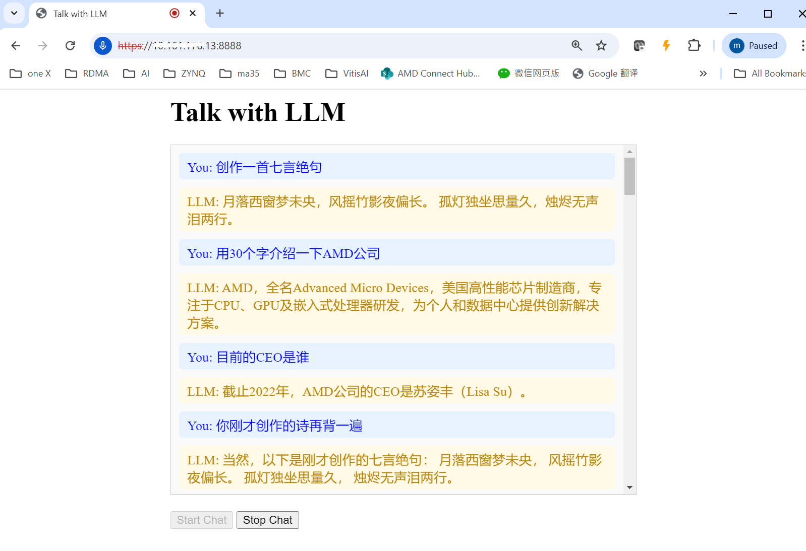

# talk_with_llm_web_version

# talk with llm

#### Install
##### Server
- #>git clone https://github.com/dibaotian/talk_with_llm.git
- #>cd talk_with_llm/server
- #>python -m venv .venv
- #>source .venv/bin/activate
- #>python server.py

##### Client
open a web broswer , input https://<IP>:8888

#### Topology 
##### client(PCM 16000 Int16 singal channel)<---udp--->server(PCM 24000 Int16 singal channel)

#### Server pipline
##### web socketio audio channel->VAD(Silero)->STT(sensevoice/wishper)->LLM(Qwen2 7B)->TTS(Chattts)->socketio PCM send channel

#### Feature
- socketio connect with server
- support short memory
- stream mode process, the client gather PCM(Int16) stream form micphone and directly send to Server
- supporting long-duration voice interactions, VAD make the system capable of continuous speech recognition and processing without relying on a wake word
- multi language support, the STT use the wisper_lagre_v3 or cosevoise(alibaba)
- LLM use Qwen2_7b, support multi-language(chinese/english etc.)
- TTS use ChatTTS， support Chinese and english，Support custom sound

#### limitation
- Only one connection supported, will move to webrtc in the futuer
- While system is processing current conversiation, it cannot be immediately interrupted to handle a new one.(LLM 有些话痨)

#### Other
##### ref: https://github.com/huggingface/speech-to-speech
##### The server was tested at python 3.10