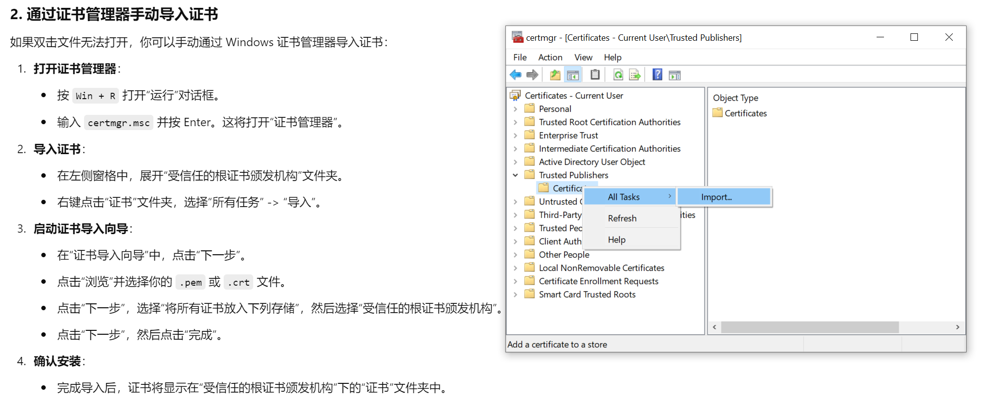

需要在网页上打开micphone采集音频信息，html的js code会调用getUserMedia

(index):57 Error accessing microphone: TypeError: Cannot read properties of undefined (reading 'getUserMedia')

浏览器通常要求在安全的环境（HTTPS）下才能访问麦克风、摄像头等敏感设备。使用HTTP协议访问时，浏览器可能会拒绝访问这些设备。

可以使用localhost或127.0.0.1（它们被认为是安全的环境）进行测试。

##### 在server 端

调试的时候一定要是用https该如何处理

使用自签名证书

1 使用 OpenSSL 生成自签名证书：

openssl req -x509 -newkey rsa:2048 -keyout key.pem -out cert.pem -days 365 -nodes

生成 key.pem 和 cert.pem 文件

2 修改 Flask 代码：

在 app.py 中，修改 socketio.run 以使用 SSL 证书：

if __name__ == '__main__':

    socketio.run(app, host='0.0.0.0', port=8888, ssl_context=('cert.pem', 'key.pem'), debug=True)

3 使用https 访问 https://<iP>:8888/

#####  在client 上需要添加证书  （这里以windows 为例）
1 下载cert.pem 到本地

